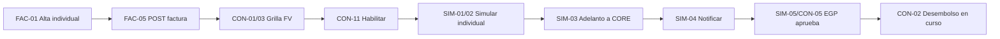

# Confirming MAGIA — Happy Path mínimo e iteraciones al MVP

**Rol:** Product Owner SR  
**Fuente:** `historias-usuario-confirming_v2.0.0.md` (derivada de `Confirming.xlsx`, filas 3–25)  
**Épica:** CONFIRMING · Portal Atlas Trade  
**POC FE:** https://marianaintive.github.io/atlas-confirming-poc/  
**Prioridad de actores:** EGP / Proveedor  
**Fuera del primer corte:** operación exclusiva de Banco / supervisión full-bank y canales de carga avanzados  

---

## Veredicto

El **happy path de valor** no es “toda la pantalla Confirming con 58 escenarios”: es el **ciclo de dinero** entre Proveedor y EGP:

> Cargar factura → verla en grilla → habilitarla → simular adelanto individual → solicitar adelanto → EGP aprueba → desembolso en curso (CORE)

Eso demuestra Confirming como producto con **mínimo desarrollo**, priorizando **EGP/Proveedor** (alineado al Login MVP) y dejando fuera carga masiva/escaneo, simulación múltiple con N cuotas, bloqueos avanzados y operación Banco-first.

---

## Qué queda fuera del happy path (y del primer feedback)

| Fuera ahora | Motivo |
|---|---|
| **FAC-02** (masivo + template + scan) | Volumen operativo; scan es spike S-CF-01 (`?` en Excel) |
| **FAC-05-a** notificaciones de alta | Valiosas, pero el valor de negocio está en el adelanto; pueden ir en It. 2 |
| **CON-02-E1 / CON-03-a** Eliminar | Operación secundaria; no cierra el ciclo de dinero |
| **CON-02-E2 / CON-04** Editar fecha de pago | Útil para recuperar NO ELEGIBLE; no hace falta para el demo feliz |
| **CON-11-E2** Bloquear | Control de riesgo; post-demo |
| **CON-09-E5 / E6** auto Vencida / No elegible | Reglas automáticas; el happy path usa facturas ya elegibles |
| **SIM-01-E1 / E2** simulación múltiple (esp. fechas distintas / N cuotas) | Spike S-CF-04 con CORE; alto costo |
| **SIM-03-E3 / E4 / E5** segregación usuario, corte 17:00, reversión | Hardening / compliance; no bloquean la primera demo |
| **SIM-05-E2** rechazo EGP | Camino alternativo; post-feliz |
| **Operación Banco “ver todo / aprobar banco”** (R-CF-04) | Excel apunta a desembolso post-EGP; Banco no es el primer usuario de valor |
| **R-CF-03** revertir adelanto / 2da aprobación | Solo en POC/permisos; no está en Excel |

---

## Happy path mínimo (Iteración 1 — “Proveedor adelanta una factura”)

**Outcome de negocio:** un Proveedor (o EGP con permiso de carga) **registra una factura elegible**, un operador la **habilita**, el Proveedor **simula y solicita adelanto**, el **EGP aprueba** y el sistema **envía la solicitud al CORE** mostrando desembolso en curso.

### Enablers (scope reducido)

| ID | Qué | Scope mínimo |
|---|---|---|
| **FAC-03 / CON-08** | `GET/obtenerInfoEnte` | Reutilizar MAGIA-120/122 (SUP-01); no rehacer |
| **CON-09-E1 / E2 / E3** | Máquina de estados | Catálogo + nace en **Pendiente** + transición a **Habilitada** |
| **CON-10** | GET estados | Contrato mínimo para FE |
| **CON-03-E1** | `GET/grillafacturas` | Filtro por dominio EGP/Proveedor (no “todas Banco”) |
| **FAC-05-E1** | `POST/cargarFactura` | Alta OK con estado inicial |
| **CON-06** (slim) | `PATCH/actualizarfactura` | Solo cambio de estado (habilitar); sin baja/editar fecha |
| **SIM-02-E1** | `GET/simularAdelantoFactura` | Cálculo OK individual |
| **SIM-03-E1** (slim) | `POST/generarAdelantoFactura` | OK → CORE; sin E3/E4/E5 aún |
| **SIM-04-E1 / E3** | Notificaciones adelanto | Solo ramas OK a EGP y Proveedor |

### Historias del corte vertical

```text
[Proveedor/EGP] FAC-01-E1 + FAC-01-E2 + FAC-04
  → FAC-05-E1          Alta factura (nace Pendiente)
  → CON-01-E1/E2/E3    Ver en grilla FV (slim)
  → CON-03-E1          Datos grilla
  → CON-11-E1          Habilitar → Habilitada
  → CON-09-E3          Transición de estado
  → SIM-01-E3/E4/E5/E6 Simular individual + límite + freeze + leyenda estimativos
  → SIM-02-E1          Cálculo OK
  → SIM-03-E1          Generar adelanto → CORE
  → SIM-04-E1/E3       Notificar EGP + Proveedor
  → CON-02-E3 + CON-05 + SIM-05-E1
                       EGP aprueba → Pendiente desembolso
  → CON-02-E4          “Desembolso en curso...”
  → CON-07-E1/E3       Límite EGP visible (disponible = API − freeze)
```

| Key | Escenario(s) IN | Rol en el happy path |
|---|---|---|
| FAC-01 | E1, E2 | Modal carga individual + validación EGP/Proveedor activos |
| FAC-04 | E1 | Moneda USD/PYG |
| FAC-05 | E1 | POST alta OK |
| CON-01 | E1–E3 (slim) | Grilla + pestañas FV/FNV/FNO + filtros básicos |
| CON-03 | E1 | GET grilla |
| CON-11 | E1 | Habilitar |
| CON-09 | E1–E3 | Estados mínimos |
| CON-10 | E1 | GET estados |
| CON-07 | E1, E3 | Cabecera EGP + límite disponible |
| CON-08 | E1 | Info ente (ya existe) |
| SIM-01 | E3–E6 | Simulación **individual** |
| SIM-02 | E1 | Cálculo OK |
| SIM-03 | E1 | Adelanto → CORE |
| SIM-04 | E1, E3 | Notificaciones OK |
| CON-02 | E3, E4 | Botón Aprobar EGP + mensaje desembolso |
| CON-05 | E1 | Modal aprobar EGP |
| SIM-05 | E1 | Aprobación EGP → desembolso |

### Recortes explícitos dentro de HUs “gordas”

- **CON-01:** filtros esenciales (nro, EGP, Proveedor, estado); sin pulir todos los combos de la POC.
- **CON-03:** respuesta scoped a EGP/Proveedor del usuario logueado (no vista Banco global).
- **CON-07:** E1+E3 primero; cabecera Proveedor (E2) puede ir al final de It. 1 o a It. 2.
- **SIM-01:** solo **individual** (E3); sin múltiple misma fecha / fechas distintas.
- **SIM-03:** solo rama feliz a CORE; validaciones de usuario distinto y horario 17:00 → It. 3.
- **Permisos (R-CF-01):** matriz mínima EGP vs Proveedor (cargar / habilitar / simular / aprobar); catálogo ABM completo después.

### Criterio de demo / feedback

> Logueado como Proveedor/EGP → cargo 1 factura → aparece en FV → la habilito → simulo adelanto → confirmo (freeze de límite) → EGP aprueba → veo “Desembolso en curso...” y notificación.

Eso valida: alta documental, máquina de estados básica, límite crediticio, simulación, integración CORE y gobernanza EGP — **sin Banco operator, sin masivo, sin N cuotas**.

---

## Iteraciones restantes hasta MVP Confirming

### Iteración 2 — Operación diaria EGP/Proveedor (cierra usabilidad)

- **FAC-05-a:** notificación al EGP al alta OK (y no notificar en error).
- **CON-07-E2:** cabecera financiera Proveedor.
- **FAC-05-E2 / SIM-02-E2 / SIM-03-E2 / SIM-04-E2/E4:** ramas de error visibles en UI.
- **CON-04 + CON-02-E2:** editar fecha de pago (recupera elegibilidad).
- **SIM-05-E2:** rechazo EGP (con/sin motivo) + liberar freeze.
- **FAC-02-E1 / E2:** template + carga masiva (sin scan).

**Feedback:** ¿pueden operar el día a día sin Mesa de Ayuda? ¿el rechazo/edición desbloquea casos reales?

### Iteración 3 — Hardening de riesgo y compliance (MVP “piloto seguro”)

- **CON-11-E2 + CON-09-E4:** bloquear (incl. desde Pendiente aprobación EGP, según Excel).
- **CON-09-E5 / E6:** auto Vencida / No elegible + vuelta a Habilitada al corregir fecha.
- **SIM-03-E3 / E4 / E5:** usuario ≠ quien cargó; corte 17:00 (S-CF-05); reversión ante error CORE.
- **SIM-02-E3:** ventana N días post-aprobación EGP (cerrar S-CF-03).
- **SIM-01-E4** reforzado + auditoría de freeze (R-CF-02).
- **CON-03-a + CON-02-E1:** eliminar con baja lógica (S-CF-02).
- **R-CF-01:** enforcement de permisos Confirming.

**Definición de MVP Confirming EGP/Proveedor:**

> Alta (individual + masiva) + grilla/estados + habilitar/bloquear + simulación individual + adelanto CORE + aprobación/rechazo EGP + notificaciones + reglas de elegibilidad/horario/segregación.

### Iteración 4 — Escala y Banco (post-MVP o MVP+)

1. **SIM-01-E1:** simulación múltiple misma fecha (1 cuota).
2. **SIM-01-E2 + S-CF-04:** múltiple con fechas distintas / N cuotas en CORE.
3. **FAC-02-E3 + S-CF-01:** escaneo (solo si negocio confirma).
4. **Vista/operación Banco** (grilla global, supervisión) + **R-CF-04** si se exige aprobación banco manual.
5. **R-CF-03:** revertir adelanto / 2da aprobación.

---

## Mapa rápido: IN / OUT por fase

| Capacidad | Happy path (It. 1) | MVP (It. 2–3) | Post (It. 4) |
|---|:---:|:---:|:---:|
| Alta factura individual + moneda | ● | ● | |
| Validar EGP/Proveedor activos | ● | ● | |
| Grilla FV/FNV/FNO + GET | ● | ● | |
| Máquina estados (Pendiente → Habilitada) | ● | ● | |
| Habilitar | ● | ● | |
| Simulación individual + freeze + límite | ● | ● | |
| Adelanto → CORE + notificaciones OK | ● | ● | |
| Aprobación EGP → desembolso en curso | ● | ● | |
| Notificación alta / cabecera Proveedor | | ● | |
| Editar fecha / rechazo EGP / carga masiva | | ● | |
| Bloquear / auto estados / 17:00 / seg. usuarios | | ● | |
| Eliminar + auditoría + permisos full | | ● | |
| Simulación múltiple / N cuotas | | | ● |
| Escaneo QR | | | ● |
| Operación Banco / aprobación banco | | | ● |

---

## Backlog de referencia (v2.0.0 → fases)

### IN Iteración 1 (happy path)

| Key | Escenarios | Capacidad |
|---|---|---|
| FAC-01 | E1, E2 | Carga individual + validación entes |
| FAC-03 | E1 | Info ente (existente) |
| FAC-04 | E1 | Multimoneda |
| FAC-05 | E1 | POST cargar OK |
| CON-01 | E1, E2, E3 | Grilla / filtros / pestañas |
| CON-03 | E1 | GET grilla |
| CON-02 | E3, E4 | Aprobar EGP visible + desembolso en curso |
| CON-05 | E1 | Modal aprobar EGP |
| CON-06 | E1 (slim) | PATCH estado |
| CON-07 | E1, E3 | Info EGP + límite disponible |
| CON-08 | E1 | Info ente financiera (existente) |
| CON-09 | E1, E2, E3 | Estados mínimos |
| CON-10 | E1 | GET estados |
| CON-11 | E1 | Habilitar |
| SIM-01 | E3, E4, E5, E6 | Simular individual |
| SIM-02 | E1 | Cálculo OK |
| SIM-03 | E1 | Generar adelanto → CORE |
| SIM-04 | E1, E3 | Notificar EGP + Proveedor |
| SIM-05 | E1 | Aprobar adelanto EGP |

### Iteración 2

| Key | Escenarios | Capacidad |
|---|---|---|
| FAC-05 | E2 | Error de alta |
| FAC-05-a | E1, E2 | Notificación alta |
| FAC-02 | E1, E2 | Template + masivo |
| CON-07 | E2 | Cabecera Proveedor |
| CON-02 | E2 | Botón editar fecha |
| CON-04 | E1 | Modal editar fecha |
| SIM-02 | E2 | Error cálculo |
| SIM-03 | E2 | Error adelanto (no CORE) |
| SIM-04 | E2, E4 | No notificar en error |
| SIM-05 | E2 | Rechazo EGP |

### Iteración 3 (cierre MVP)

| Key | Escenarios | Capacidad |
|---|---|---|
| CON-11 | E2 | Bloquear |
| CON-09 | E4, E5, E6 | Bloqueo + autos Vencida/No elegible |
| CON-02 | E1 | Botón eliminar |
| CON-03-a | E1 | Modal eliminar |
| SIM-02 | E3 | Ventana N días |
| SIM-03 | E3, E4, E5, E6 | Segregación, 17:00, reversión, freeze recalc |
| — | R-CF-01, R-CF-02 | Permisos + auditoría |

### Iteración 4 (post-MVP)

| Key | Escenarios | Capacidad |
|---|---|---|
| SIM-01 | E1, E2 | Múltiple / N cuotas |
| FAC-02 | E3 | Escaneo (si S-CF-01 = sí) |
| — | Vista Banco, R-CF-03, R-CF-04 | Supervisión / reversión / aprobación banco |

---

## Spikes a cerrar (impactan roadmap)

| ID | Pregunta | Impacto | Cuándo |
|---|---|---|---|
| **S-CF-01** | ¿Escaneo en MVP? | FAC-02-E3 in/out | Antes de It. 4 (recomendado: **out** del MVP) |
| **S-CF-02** | ¿Baja lógica o física? | Eliminar | Antes de It. 3 → **lógica + auditoría** |
| **S-CF-03** | N días post-aprobación EGP | SIM-02-E3 | Antes de It. 3 |
| **S-CF-04** | N cuotas CORE | SIM-01-E2 | Antes de It. 4 |
| **S-CF-05** | TZ / feriados corte 17:00 | SIM-03-E4 | Antes de It. 3 → America/Asunción |

---

## Decisiones PO a cerrar

1. **Actor primario del demo = Proveedor + EGP**; Banco queda como supervisor post-MVP (salvo compliance lo exija antes).
2. **Simulación individual primero**; múltiple/N cuotas no entran al happy path ni al MVP base.
3. **Escaneo fuera del MVP** hasta cerrar S-CF-01 con negocio.
4. **Habilitar es parte del happy path** (sin él no hay adelanto); bloquear/eliminar/editar van después.
5. **CORE real en It. 1** (aunque sea stub controlado de integración): sin “envío a CORE”, el demo no prueba el valor de Confirming.
6. Unificar keys duplicados en Excel/Jira (`FAC-05-a`, `CON-03-a`) — R-CF-05.

---

## Diagrama del happy path



---

## Relación con Login MVP (EGP/Proveedor)

| Login (previo) | Confirming (este doc) |
|---|---|
| Happy path: EGP/Proveedor entra al portal | Happy path: EGP/Proveedor opera Confirming |
| Banco/AD fuera del primer corte | Operación Banco fuera del primer corte |
| Demo: mail → pass → 2FA → home | Demo: factura → habilitar → adelanto → aprobación EGP |

Dependencia: el demo Confirming It. 1 asume usuarios EGP/Proveedor autenticados (Login happy path o usuarios de prueba en Keycloak).

---

## Próximos pasos sugeridos

1. Bajar It. 1 a un board con tickets **IN / OUT** y DoD de demo.
2. Confirmar con negocio S-CF-01 / S-CF-03 (escaneo y ventana N días).
3. Acordar stub vs integración real CORE para el primer demo.
4. Alinear permisos mínimos Proveedor vs EGP (R-CF-01 slim) con el Login de dominios.
