# Confirming MAGIA — Happy Path mínimo e iteraciones al MVP  
### (fuente OPUS5 v1.0.0)

**Rol:** Product Owner SR  
**Fuente:** `OPUS5-historias-usuario-confirming_v1.0.0.md`  
**Origen de alcance:** `Confirming.xlsx` (filas 3–25) + POC Confirming v2.11.3  
**Épica:** CONFIRMING · Portal Atlas Trade  
**Backlog fuente:** **25 HU** · **13 HT** · **3 TAR** · **23 spikes** · **17 recomendaciones**  
**Prioridad de actores:** EGP / Proveedor  
**Fuera del primer corte:** operación exclusiva de Banco, carga avanzada y simulación múltiple / N cuotas  

> **Nota vs v2.0.0:** este plan usa la **nomenclatura OPUS5** (`FAC-01.1`, `FAC-05a/b`, `CON-03a/b`, `SIM-01.1`…). El valor de negocio del happy path es el mismo que en `Confirming-MVP-Happy-Path-EGP-Proveedor.md` (derivado de v2); cambia el empaquetado de historias (más consolidado, menos tarjetas por escenario).

---

## Veredicto

El **happy path de valor** no es “las 25 HU + 13 HT completas”: es el **ciclo de dinero** entre Proveedor y EGP, con el menor desarrollo posible:

> Cargar factura individual → verla en grilla → habilitar → simular adelanto **individual** → solicitar adelanto → EGP aprueba → desembolso en curso (CORE)

Eso demuestra Confirming como producto, prioriza **EGP/Proveedor** (alineado al Login MVP) y deja fuera Banco-first, masivo/escaneo, múltiple/N cuotas, bloqueos avanzados y buena parte de hardening.

---

## Actores del corte (y quién queda fuera)

| Actor | En happy path | Rol |
|---|:---:|---|
| **Usuario Proveedor** | ● | Consulta y solicita adelanto (`SIM-01.1`) |
| **Operador de carga EGP** | ● | Carga y habilita facturas |
| **Aprobador EGP** | ● | Aprueba el adelanto (`SIM-05.1`) |
| **Operador / Supervisor Banco** | ○ | Fuera del primer corte (vista global / excepciones / reversión) |
| **CORE BANKING** | ● | Desembolso (integración real o stub controlado en demo) |
| **Notificaciones** | ● (slim) | Solo ramas OK de adelanto |

---

## Qué queda fuera del happy path (y del primer feedback)

| Fuera ahora | IDs OPUS5 | Motivo |
|---|---|---|
| Carga masiva / template | `FAC-02.1`, `FAC-02.2` | Volumen operativo, no cierra el ciclo de 1 factura |
| Escaneo | `FAC-02.3` | Excel con `?` → `SPK-C12` |
| Notificación de alta | `FAC-05b` | Valiosa; el valor está en el adelanto → It. 2 |
| Eliminar | `CON-03b` + AC eliminar de `CON-02` | Operación secundaria; `SPK-C04` |
| Editar fecha de pago | `CON-04` + AC editar de `CON-02` | Recuperación NO ELEGIBLE; post-demo |
| Bloquear | `CON-11.2` | Control de riesgo; `SPK-C02` |
| Autos Vencida / NO ELEGIBLE | `CON-09.2`, `CON-09.3` | Reglas automáticas; demo usa facturas elegibles |
| Simulación múltiple | `SIM-01.2` | Escala; no necesaria para 1 cuota |
| Múltiple fechas / N cuotas | `SIM-01.3` | `SPK-C21` con CORE; alto costo |
| Rechazo EGP | `SIM-05.2` | Camino alternativo; It. 2 |
| Validaciones SIM-03 (≠ usuario, 17 hs, reversión) | ACs de `SIM-03` | Hardening / `SPK-C06` → It. 3 |
| Aprobación Banco manual | — | `SPK-C07` / S-05: POC ya va directo a CORE |
| Reversión / 2da aprobación | R-13 | Solo permisos POC; no está en Excel |
| Cabecera Proveedor completa | `CON-07.2` | Puede ir al final de It. 1 o It. 2 (`SPK-C18`) |

---

## Happy path mínimo (Iteración 1 — “Proveedor adelanta una factura”)

**Outcome de negocio:** un Proveedor (o EGP con permiso de carga) **registra una factura elegible**, se **habilita**, el Proveedor **simula y solicita adelanto individual**, el **EGP aprueba** y el sistema **envía al CORE**, mostrando desembolso en curso.

### Enablers / tareas (scope reducido)

| ID | Qué | Scope mínimo |
|---|---|---|
| `FAC-03` / `CON-08` | `GET /obtenerInfoEnte` | Reuso MAGIA-120/122 |
| `CON-09.1` | Motor de estados | Catálogo + nace `Pendiente` + → `Habilitada` (+ destino post-solicitud / post-aprobación) |
| `CON-10` | `GET /estadosDeFacturas` | Contrato mínimo FE |
| `CON-03a` | `GET /grillaFacturas` | Scoped a EGP/Proveedor del usuario (**no** vista Banco global) |
| `FAC-05a` | `POST /cargarFactura` | Alta OK (+ error básico si el equipo da) |
| `CON-06` | `PATCH /actualizarFactura` | Cambio de estado (habilitar / pasar a Pendiente aprobación EGP / Pendiente desembolso); sin baja ni editar fecha |
| `SIM-02` | `GET /simularAdelantoFactura` | Cálculo OK individual |
| `SIM-03` | `POST /generarAdelantoFactura` | **Slim:** OK → CORE; sin ACs de segregación/17hs/reversión |
| `SIM-04` | `POST /notificacionAdelantoFactura` | Ramas OK EGP + Proveedor |
| `TAR-C01` | Parámetros | Valores iniciales acordados (30 días, 17 hs…) aunque aún no se enforcen todos |
| `TAR-C02` | Permisos | **Matriz mínima** Proveedor vs EGP (ver / cargar / habilitar / simular / aprobar); no catálogo completo |

### Historias del corte vertical

```text
[EGP carga / Proveedor según permiso]
  FAC-01.1 + FAC-01.2 + FAC-04
    → FAC-05a                 Alta (nace Pendiente)
    → CON-01.1 / .2 / .3      Ver en grilla FV (slim)
    → CON-03a                 Datos grilla
    → CON-11.1                Habilitar → Habilitada
    → CON-09.1                Transiciones mínimas
    → SIM-01.1                Simular individual + solicitar
    → SIM-01.4 + SIM-01.5     Límite suficiente + freeze  (*)
    → SIM-02 / SIM-03 (slim)  Cálculo + adelanto → CORE
    → SIM-04 (OK)             Notificar EGP + Proveedor
    → CON-02 (slim)           Botón Aprobar EGP + “Desembolso en curso…”
    → CON-05 + SIM-05.1       EGP aprueba → Pendiente desembolso
    → CON-07.1 + CON-07.3     Límite EGP visible (API − freeze)
```

\* `SIM-01.4` / `SIM-01.5` entran en It. 1 porque sin freeze/límite el adelanto no es creíble para negocio. Si el equipo está justo de capacidad, el **demo mínimo absoluto** puede mostrar simulación + solicitud sin freeze real y subir freeze a It. 2 — con riesgo de feedback falso sobre crédito.

| ID | En It. 1 | Rol |
|---|:---:|---|
| `FAC-01.1` | ● | Modal carga individual |
| `FAC-01.2` | ● | Validar EGP/Proveedor activos |
| `FAC-04` | ● | Moneda USD / GS-PYG (`SPK-C13` literal) |
| `FAC-03` | ● | Info ente (reuso) |
| `FAC-05a` | ● | POST alta |
| `CON-01.1` `.2` `.3` | ● slim | Grilla + filtros básicos + pestañas |
| `CON-03a` | ● | GET grilla |
| `CON-02` | ● slim | Solo Aprobar EGP + mensaje desembolso |
| `CON-05` | ● | Modal aprobación EGP (datos bloqueados) |
| `CON-06` | ● slim | PATCH estados del camino feliz |
| `CON-07.1` `.3` | ● | Cabecera EGP + límite disponible |
| `CON-08` | ● | Info financiera ente (reuso) |
| `CON-09.1` | ● slim | Motor estados del camino feliz |
| `CON-10` | ● | GET estados |
| `CON-11.1` | ● | Habilitar (multi OK si reusa mismo PATCH) |
| `SIM-01.1` | ● | Simulación individual (corazón del producto) |
| `SIM-01.4` | ● | Impedir exceder límite EGP |
| `SIM-01.5` | ● | Freeze al confirmar |
| `SIM-02` | ● slim | Cálculo OK |
| `SIM-03` | ● slim | Generar adelanto → CORE |
| `SIM-04` | ● slim | Notificaciones OK |
| `SIM-05.1` | ● | Aprobación EGP → desembolso |

### Recortes explícitos dentro de historias “gordas”

- **`CON-02`:** implementar solo ACs de **Aprobar EGP** y **Desembolso en curso…**; Eliminar/Editar → It. 2–3.
- **`CON-01.x`:** filtros esenciales; sin pulir paginación (R-02) ni todos los combos.
- **`CON-03a`:** respuesta por dominio del usuario logueado (EGP/Proveedor).
- **`SIM-03`:** solo rama feliz a CORE; ACs de usuario distinto, 17 hs y reversión → It. 3.
- **`SIM-04`:** solo notificar en OK; ramas ERROR → It. 2.
- **`TAR-C02`:** permisos mínimos de aislamiento EGP↔Proveedor (R-01); catálogo ABM completo después.
- **`MSG-C43`:** leyenda “valores estimativos” — **redactar y aprobar antes** de entrar `SIM-01.1` a sprint (DoR OPUS5).

### Criterio de demo / feedback

> Como Proveedor/EGP: cargo 1 factura → aparece en FV → la habilito → simulo → confirmo (freeze) → EGP aprueba → veo “Desembolso en curso…” y notificaciones.

Valida: alta, estados, límite, simulación, CORE y gobernanza EGP — **sin Banco operator, sin masivo, sin N cuotas**.

---

## Iteraciones restantes hasta MVP Confirming

### Iteración 2 — Operación diaria EGP/Proveedor

| Incluir | Para qué |
|---|---|
| `FAC-05b` | Notificar alta al EGP (y no en error) |
| `CON-07.2` | Cabecera Proveedor (cerrar `SPK-C18` o stub) |
| `CON-04` + AC editar de `CON-02` | Editar fecha de pago / recuperar elegibilidad |
| `SIM-05.2` | Rechazo EGP con/sin motivo (`SPK-C08`) + liberar freeze (`SPK-C19`) |
| `FAC-02.1` / `FAC-02.2` | Template + carga masiva (sin escaneo) |
| Ramas ERROR de `FAC-05a`, `SIM-02`, `SIM-03`, `SIM-04` | Feedback usable ante fallos |
| R-05 | Confirmación explícita en aprobación EGP |

**Feedback:** ¿pueden operar el día a día? ¿rechazo/edición desbloquean casos reales?

### Iteración 3 — Hardening (MVP “piloto seguro”)

| Incluir | Para qué |
|---|---|
| `CON-11.2` + ACs bloqueo de `CON-09.1` | Bloquear (`SPK-C02`) |
| `CON-09.2` / `CON-09.3` | Auto Vencida / NO ELEGIBLE (`SPK-C01`, `SPK-C23`) |
| ACs restantes de `SIM-03` | Segregación usuario, corte 17 hs (`SPK-C06`), reversión CORE |
| Ventana N días en `SIM-02` | Expiración post-aprobación EGP |
| `CON-03b` + AC eliminar de `CON-02` | Eliminar con baja lógica (`SPK-C04`) |
| `TAR-C02` completo + R-01 | Enforcement permisos |
| `TAR-C03` + R-04 | Auditoría + motivos visibles |
| R-03 | Control de duplicados (`SPK-C05`) |
| R-06 | Concurrencia básica |

**Definición de MVP Confirming EGP/Proveedor (OPUS5):**

> Alta (individual + masiva) + grilla/estados + habilitar/bloquear + simulación individual + adelanto CORE + aprobación/rechazo EGP + notificaciones + reglas de elegibilidad/horario/segregación + permisos + auditoría mínima.

### Iteración 4 — Escala y Banco (post-MVP / MVP+)

| Incluir | Para qué |
|---|---|
| `SIM-01.2` | Simulación múltiple misma fecha (1 cuota) |
| `SIM-01.3` + `SPK-C21` / `SPK-C22` | Fechas distintas / N cuotas + aprobación múltiple |
| `FAC-02.3` + `SPK-C12` | Escaneo (solo si negocio dice sí) |
| Vista/operación Banco | Grilla global, supervisión |
| `SPK-C07` / R-13 | Aprobación banco manual y/o reversión con 2da aprobación |
| R-02, R-07–R-12, R-14–R-17 | UX operativa (paginación, export, docs, historial, etc.) |

---

## Mapa rápido: IN / OUT por fase

| Capacidad | Happy path (It. 1) | MVP (It. 2–3) | Post (It. 4) |
|---|:---:|:---:|:---:|
| Alta individual + moneda + validar entes | ● | ● | |
| Grilla FV/FNV/FNO + GET | ● | ● | |
| Estados Pendiente → Habilitada → … desembolso | ● | ● | |
| Habilitar | ● | ● | |
| Simulación individual + límite + freeze | ● | ● | |
| Adelanto → CORE + notificaciones OK | ● | ● | |
| Aprobación EGP → desembolso en curso | ● | ● | |
| Notificación alta / cabecera Proveedor | | ● | |
| Editar fecha / rechazo EGP / carga masiva | | ● | |
| Bloquear / autos estados / 17 hs / seg. usuarios | | ● | |
| Eliminar + auditoría + permisos full | | ● | |
| Simulación múltiple / N cuotas | | | ● |
| Escaneo | | | ● |
| Operación Banco / reversión / aprobación banco | | | ● |

---

## Backlog OPUS5 → fases (resumen)

### Iteración 1 — IN

**HU:** `FAC-01.1`, `FAC-01.2`, `FAC-04`, `CON-01.1`, `CON-01.2`, `CON-01.3`, `CON-02` (slim), `CON-05`, `CON-07.1`, `CON-07.3`, `CON-11.1`, `SIM-01.1`, `SIM-01.4`, `SIM-01.5`, `SIM-05.1`  

**HT:** `FAC-03`, `FAC-05a`, `CON-03a`, `CON-06` (slim), `CON-08`, `CON-09.1` (slim), `CON-10`, `SIM-02` (slim), `SIM-03` (slim), `SIM-04` (slim)  

**TAR:** `TAR-C01` (valores iniciales), `TAR-C02` (matriz mínima)

### Iteración 2

`FAC-05b`, `FAC-02.1`, `FAC-02.2`, `CON-07.2`, `CON-04`, `SIM-05.2`, ramas ERROR de HT, R-05; completar ACs diferidos de `CON-02` (editar)

### Iteración 3

`CON-11.2`, `CON-09.2`, `CON-09.3`, `CON-03b`, resto `SIM-03` / `SIM-02`, `TAR-C02` full, `TAR-C03`, R-01, R-03, R-04, R-06

### Iteración 4

`SIM-01.2`, `SIM-01.3`, `FAC-02.3` (condicional), Banco, R-13, resto R-07+

---

## Spikes a cerrar (impacto en roadmap)

| Spike | Pregunta | Bloquea | Cuándo cerrar |
|---|---|---|---|
| `SPK-C13` | Literal GS vs PYG | `FAC-04` | Antes de It. 1 |
| `SPK-C10` | Qué estados ABM = “activo” | `FAC-01.2` | Antes de It. 1 |
| `SPK-C20` | Días a adelantar: vencimiento vs pago | `SIM-01.1`, `SIM-02` | Antes de It. 1 |
| `SPK-C19` | Ciclo de vida del freeze | `SIM-01.5`, `CON-07.3` | Antes de It. 1 |
| `SPK-C07` | ¿Aprobación banco automática? | Flujo post-EGP | Antes de It. 1 (asumir **sí** = POC) |
| `SPK-C08` | Motivo de rechazo | `SIM-05.2` | Antes de It. 2 |
| `SPK-C18` | Origen créditos/morosidad Proveedor | `CON-07.2` | Antes de It. 2 |
| `SPK-C04` | Baja lógica vs física | `CON-03b` | Antes de It. 3 → **lógica** |
| `SPK-C02` | Bloquear en Pendiente aprobación EGP | `CON-11.2` | Antes de It. 3 |
| `SPK-C01` / `SPK-C23` | Regla Vencida / NO ELEGIBLE en el tiempo | `CON-09.2/.3` | Antes de It. 3 |
| `SPK-C06` | TZ / feriados 17 hs | `SIM-03` | Antes de It. 3 |
| `SPK-C05` | Clave única factura | Alta / R-03 | Antes de It. 3 |
| `SPK-C12` | Tecnología de escaneo | `FAC-02.3` | Antes de It. 4 (recomendado: **out** MVP) |
| `SPK-C21` / `SPK-C22` | N cuotas / aprobación múltiple | `SIM-01.3`, `SIM-05.x` | Antes de It. 4 |

---

## Decisiones PO a cerrar

1. **Actor primario del demo = Proveedor + EGP**; Banco queda post-MVP (salvo compliance).
2. **`SIM-01.1` es el corazón del producto** — no se demora por múltiple/N cuotas.
3. **`SIM-01.4` + `SIM-01.5` van con el happy path** (límite/freeze = credibilidad de negocio).
4. **Escaneo fuera del MVP** hasta cerrar `SPK-C12`.
5. **Aprobación banco = automática** (`SPK-C07` / S-05) para no reabrir botones Banco en It. 1–3.
6. **CORE en It. 1** (real o stub controlado): sin envío a CORE el demo no prueba Confirming.
7. **Redactar `MSG-C43`** antes de sprint de `SIM-01.1`.
8. Mantener keys desambiguados `FAC-05a/b`, `CON-03a/b` al pasar a Jira.

---

## Diagrama del happy path

```mermaid
flowchart LR
  A[FAC-01.1 Alta individual] --> B[FAC-05a POST factura]
  B --> C[CON-01 / CON-03a Grilla FV]
  C --> D[CON-11.1 Habilitar]
  D --> E[SIM-01.1 Simular individual]
  E --> F[SIM-01.5 Freeze límite]
  F --> G[SIM-03 Adelanto a CORE]
  G --> H[SIM-04 Notificar]
  H --> I[SIM-05.1 / CON-05 EGP aprueba]
  I --> J[CON-02 Desembolso en curso]
```



---

## Relación con otros planes

| Documento | Relación |
|---|---|
| `Login-MVP-Happy-Path-EGP-Proveedor.md` | Habilita usuarios EGP/Proveedor para el demo Confirming |
| `Confirming-MVP-Happy-Path-EGP-Proveedor.md` (v2.0.0) | Misma estrategia de valor; **este archivo** es la versión alineada a IDs OPUS5 |
| `OPUS5-historias-usuario-confirming_v1.0.0.md` | Fuente de tarjetas, RN, MSG, spikes y DoR/DoD |

Dependencia: It. 1 asume Login EGP/Proveedor listo **o** usuarios de prueba en Keycloak.

---

## Próximos pasos sugeridos

1. Bajar It. 1 a board con tickets **IN / OUT / slim** y DoD de demo.
2. Cerrar spikes bloqueantes de It. 1: `SPK-C10`, `SPK-C13`, `SPK-C19`, `SPK-C20`, `SPK-C07`.
3. Acordar stub vs integración real CORE para el primer demo.
4. Aprobar `MSG-C43` y matriz mínima de permisos (`TAR-C02` slim).
5. Al pasar a Jira, no re-partir OPUS5 en 58 escenarios salvo que el equipo lo pida: **respetar el empaquetado INVEST de OPUS5**.
