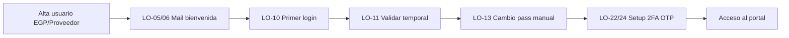

# Login MAGIA — Happy Path mínimo e iteraciones al MVP

**Rol:** Product Owner SR  
**Fuente:** `login (3) - con Jira (1).xlsx` (épica MAGIA-155)  
**Prioridad:** EGP / Proveedor  
**Fuera del primer corte:** Login Banco / AD  

---

## Veredicto

El **happy path de valor** no es “Login completo para todos los perfiles”: es **EGP/Proveedor con contraseña manual + OTP por mail**, dejando **Banco/AD y Homebanking fuera** del primer corte.

Eso permite demostrar en poco tiempo:

> Alta → bienvenida → primer acceso → cambio de pass → 2FA → entrar al portal

---

## Qué queda fuera del happy path (y del primer feedback)

| Fuera ahora | Motivo |
|---|---|
| **LO-03, LO-07, LO-21, LO-30** (todo Banco/AD) | Ya desestimado o spike; no aporta al usuario externo |
| **LO-12 / integración Homebanking** | Spike abierto (S-02); más caro y no bloquea el valor |
| **LO-14 / LO-18** | Duplican LO-10; LO-10 ya cubre EGP + Proveedor cliente/no cliente |
| **Dispositivo confiable, idle timeout, unlock/forgot, bloqueo N intentos** | Seguridad/operación; valen después de validar el flujo feliz |
| **Federación AD en LO-01** | Solo necesaria para Banco; en EGP alcanza Keycloak local + temporales |

---

## Happy path mínimo (Iteración 1 — “Proveedor entra a Confirming”)

**Outcome de negocio:** un usuario EGP/Proveedor dado de alta puede **recibir credenciales, autenticarse, dejar de usar la temporal y entrar al portal** con 2FA por mail.

### Enablers (scope reducido)

| ID | Qué | Scope mínimo |
|---|---|---|
| **LO-01** (MAGIA-372) | OAuth/Keycloak | Realm + clients FE/BFF + Auth Code + PKCE. **Sin AD** |
| **LO-02** | DER | Solo entidades del camino: usuario, credencial temporal, notificación, OTP, sesión básica |
| **MAGIA-373** (XX) | Open-API Atlas | JWT + conectividad BFF ↔ Atlas |
| **MAGIA-374** | Servicios de mail | Templates bienvenida + OTP; envío de prueba real |
| **MAGIA-375** | SPEC CORE | Ente Trade + permisos de notificaciones |

### Historias del corte vertical

```text
Alta usuario (asumida)
  → LO-05 + LO-06   Mail bienvenida (user + pass temporal)
  → LO-10 (slim)    Primer login
  → LO-11           Validar temporal (passwordTemporal=true)
  → LO-13           Cambio pass MANUAL (sin Homebanking)
  → LO-22 (slim)    Setup 2FA OTP mail
  → LO-24           Envío/validación OTP
  → Acceso al portal (landing/home vacío alcanza para demo)
```

| ID Jira | Key Excel | Capacidad en el happy path |
|---|---|---|
| MAGIA-351 | LO-05 | Mail bienvenida EGP/Proveedor |
| MAGIA-362 | LO-06 | EP envío de mail + histórico/reintentos |
| MAGIA-353 | LO-10 | Pantalla primer login (solo pass manual) |
| MAGIA-363 | LO-11 | Validar mail/pass temporal vs Keycloak |
| MAGIA-364 | LO-13 | Actualizar contraseña ingresada por el usuario |
| MAGIA-354 | LO-22 | Configuración 2FA primer login EGP/Proveedor |
| MAGIA-365 | LO-24 | Envío/validación OTP |

### Recortes explícitos dentro de HUs “gordas”

- **LO-10:** solo escenario de validar temporal + pass manual. Sin MSG-13 / Homebanking.
- **LO-22:** mail fijo del usuario + OTP; sin “cambiar correo de recepción” ni TOTP.
- **LO-25 / LO-26 / LO-27:** opcionales en la misma iteración si el equipo da; si no, van a Iteración 2. El demo puede terminar en “primer acceso post-2FA”.

### Criterio de demo / feedback

> Alta un Proveedor → llega el mail → entra → cambia pass → valida OTP → ve el portal.

Eso valida: onboarding externo, canal mail, política de temporales, seguridad básica y UX de primer ingreso — **sin depender de Banco ni de Homebanking**.

---

## Iteraciones restantes hasta MVP Login

### Iteración 2 — Login recurrente (cierra el ciclo de uso)

- **LO-25 + LO-26** (MAGIA-355 / MAGIA-367): acceso con pass definitiva (origen transparente en Keycloak; solo canal **MANUAL**).
- **LO-27 (slim) + LO-28** (MAGIA-356 / MAGIA-368): 2FA en siguientes logins **siempre tras cierre de sesión**; sin dispositivo confiable aún.
- Cookie/sesión básica (parte de MAGIA-369).

**Feedback:** ¿el retorno al portal es usable? ¿OTP en cada login es aceptable?

### Iteración 3 — Hardening de seguridad (MVP “seguro para piloto”)

- **LO-34 + LO-35** (MAGIA-361 / MAGIA-371): bloqueo por N intentos.
- **LO-29** (MAGIA-357): cierre por inactividad (warning + extend).
- **LO-27 completo:** dispositivo confiable + reglas RN-06.
- Auditoría mínima de intentos (RN-08).

**Feedback:** ¿el piloto externo puede operar sin Mesa de Ayuda saturada?

### Iteración 4 — Autogestión de acceso (cierra MVP EGP/Proveedor)

- **LO-32 + LO-33** (MAGIA-360 / MAGIA-370): forgot/cambio pass **manual** (+ OTP).
- Reenvío de bienvenida / temporal vencida (ya anticipado en LO-05 / LO-10).
- Mensajería de error estabilizada (MSG-*).

**Definición de MVP Login EGP/Proveedor:**

> Onboarding + primer login + login recurrente + 2FA + bloqueo/idle + recuperación manual.

### Iteración 5 — Extensiones (post-MVP o MVP+)

1. **Homebanking** (LO-12 / canal en LO-10–LO-31) — solo si el spike S-02 lo justifica.
2. **Banco/AD** (LO-07 + federación AD en LO-01; LO-30 informativo) — otro happy path, no el primero.

---

## Mapa rápido: IN / OUT por fase

| Capacidad | Happy path (It. 1) | MVP (It. 2–4) | Post (It. 5) |
|---|:---:|:---:|:---:|
| Keycloak local + OAuth | ● | ● | |
| Mail bienvenida EGP/Prov | ● | ● | |
| Primer login + pass manual | ● | ● | |
| 2FA OTP setup | ● | ● | |
| Login recurrente + 2FA | ○* | ● | |
| Bloqueo / idle / device trust | | ● | |
| Forgot pass manual | | ● | |
| Homebanking | | | ● |
| Login Banco/AD | | | ● |

\*○ = ideal en Iteración 2; si el equipo puede, se sube al final de la 1 para un demo más fuerte.

---

## Backlog de referencia (Excel → Jira)

### Enablers

| Key | Jira | Summary |
|---|---|---|
| LO-01 | MAGIA-372 | Implementar servicio OAuth |
| LO-02 | — | Estructura DER LOGIN |
| XX | MAGIA-373 | Configuración de ente Open-API Atlas |
| — | MAGIA-374 | Atlas Core / Trade — servicios de mail |
| — | MAGIA-375 | SPEC CORE |

### Historias EGP / Proveedor (priorizadas)

| Key | Jira | Summary | Fase sugerida |
|---|---|---|---|
| LO-05 | MAGIA-351 | Mail Bienvenida EGP/Proveedor | It. 1 |
| LO-06 | MAGIA-362 | EP POST BE — Envío de mail | It. 1 |
| LO-10 | MAGIA-353 | Pantalla primer login EGP/Proveedor | It. 1 (slim) |
| LO-11 | MAGIA-363 | Validar mail/pass temporal | It. 1 |
| LO-13 | MAGIA-364 | Actualizar contraseña manual | It. 1 |
| LO-22 | MAGIA-354 | 2FA configuración primer login | It. 1 (slim) |
| LO-24 | MAGIA-365 | Envío/validación OTP | It. 1 |
| LO-25 | MAGIA-355 | Acceso próximo login password | It. 2 |
| LO-26 | MAGIA-367 | Validación credenciales | It. 2 |
| LO-27 | MAGIA-356 | 2FA accesos posteriores | It. 2 slim / It. 3 full |
| LO-28 | MAGIA-368 | Validación de 2FA | It. 2 |
| — | MAGIA-369 | Cookie de sesión | It. 2 |
| LO-29 | MAGIA-357 | Cierre de sesión por inactividad | It. 3 |
| LO-34 | MAGIA-361 | Bloqueo N intentos FE | It. 3 |
| LO-35 | MAGIA-371 | EP validación pass / flag bloqueo | It. 3 |
| LO-32 | MAGIA-360 | Cambio/desbloqueo pass manual | It. 4 |
| LO-33 | MAGIA-370 | EP PATCH cambio de contraseña | It. 4 |
| LO-12 | — | Actualizar pass vía Homebanking | It. 5 |
| LO-31 | MAGIA-359 | Cambio/desbloqueo pass Homebanking | It. 5 |

### Historias Banco (fuera del happy path y del MVP EGP)

| Key | Jira | Summary | Fase |
|---|---|---|---|
| LO-03 | — | Mail bienvenida Banco | Fuera (desestimada) |
| LO-07 | MAGIA-352 | Primer login Banco (AD) | It. 5 |
| LO-21 | — | 2FA primer login Banco | Fuera (lo gestiona AD) |
| LO-30 | MAGIA-358 | Cambio/desbloqueo pass Banco | It. 5 |

### Duplicados a consolidar

| Key | Acción |
|---|---|
| LO-14 | Consolidar en LO-10 (Proveedor cliente) |
| LO-18 | Consolidar en LO-10 (Proveedor no cliente) |
| LO-15 / LO-16 / LO-17 / LO-19 / LO-20 | Cubiertos por LO-11 / LO-13 (y LO-12 solo si entra Homebanking) |

---

## Decisiones PO a cerrar

1. **Homebanking fuera del happy path** (opción 2 o 3 del spike de LO-10): no bloquea valor.
2. **LO-14 / LO-18** se consolidan en **LO-10**; no se estiman aparte.
3. **LO-01 sin AD** en Iteración 1: reduce riesgo y tiempo.
4. **MVP = solo EGP/Proveedor**; Banco es un segundo producto de autenticación.

---

## Diagrama del happy path



---

## Próximos pasos sugeridos

1. Bajar este plan a un board de sprint con tickets **IN / OUT** y DoD de demo.
2. Reescribir en Jira el alcance slim de **LO-01**, **LO-10** y **LO-22**.
3. Cerrar formalmente el spike S-02 (Homebanking) como **post-MVP**.
